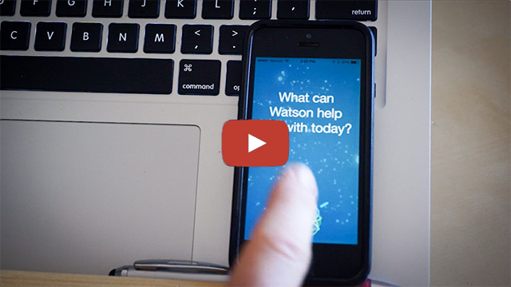
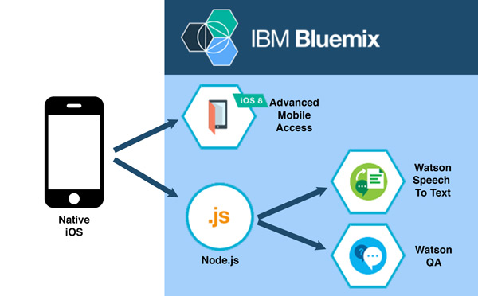
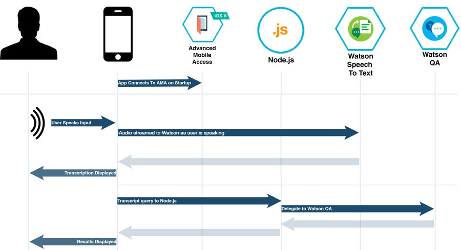
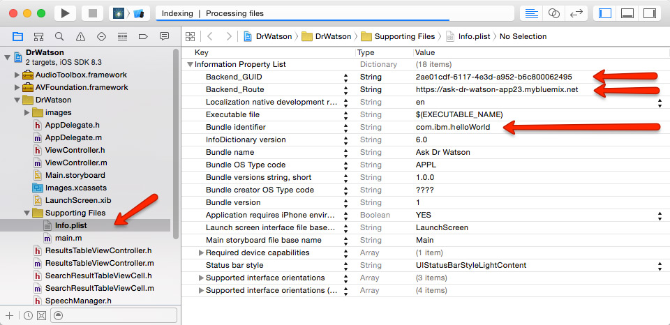
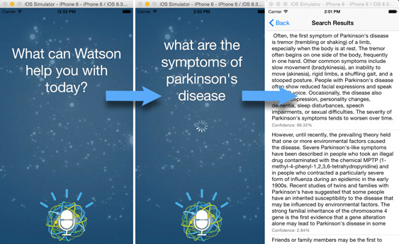

# Overview
"Ask Dr Watson" is a native iOS app that re-creates a Siri-like experience using the [Watson Speech to Text][watson_stt_url] and [Question &amp; Answer][watson_qa_url] services, with operational analytics powered by the [Advanced Mobile Access][ama_url] service on [IBM Bluemix][bluemix_signup_url]. The native iOS app allows you to ask Watson questions in spoken language, and receive textual responses based on the [Watson QA Healthcare data set][watson_healthcare_url].

This app is meant to serve as a demo to showcase how you could integrate IBM Watson, IBM Bluemix, or IBM MobileFirst solutions into your mobile applications.

You can see a preview of this app in action and a brieft walkthrough of the code in the following video preview: 

[https://youtu.be/0kedhwC3ikY][youtube_video_snip_url]

[][youtube_video_snip_url]<br/>


### Bluemix Services Used

1. [Advanced Mobile Access][ama_url] - Capture analytics and logs from mobile apps running on devices
2. [Watson Speech to Text][watson_stt_url] - Convert spoken audio into text
3. [Question &amp; Answer][watson_qa_url] - Natural language search 

### Architecture Diagram

This an architectural overview of the components that make this app run.   


	
The mobile application connects to the [Advanced Mobile Access][ama_url] service to provide operational analytics (usage, devices, network utilization) and remote log collection from the client app on the mobile devices.

The app communicates to the [Watson Speech to Text][watson_stt_url] and [Question &amp; Answer][watson_qa_url] servies through the Node.js middelware tier.  

For the Speech To Text service, the app records audio from the local device, and sends a WAV file to the Node.js in a HTTP post request.  The Node.js tier then delegates to the Watson Speech To Text service to provide transcription capabilities.  The Node.js tier then formats the respons JSON object and returns the query to the mobile app.  

For the QA service, the app makes an HTTP GET request (containing the query string) to the Node.js server, which delegates to the Watson QA natural language processing service to return search results. The Node.js tier then formats the respons JSON object and returns the query to the mobile app. 

### Order of Operations

The provide interactive feedback to the end user of the mobile application, the Speech To Text and QA service requests have been separated out into separate service methods.  They could be combined into a single query/response, however, the decision was made to keep them separate so that feedback could be provided to the user as the search is taking place.  

The general flow is outlined below:



<br/><br/>

---------

## Setting up the App

This app consists of two parts: a native iOS app (Xcode project) and the backend services running on Bluemix.  Both of these services need to be configured for the application to work properly.

### Setting Up The Bluemix Backend

There are two ways that you can configure the back-end Bluemix application.  You can either use the web-based GUI or you can use the command line interface.  These instructions will walk through setting up the Node.js backend applicaiton using the [Cloud Foundry Command Line Interface][cloud_foundry_url].  

1. Create a Bluemix Account

    [Sign up][bluemix_signup_url] for Bluemix, or use an existing account.

2. Download and install the [Cloud-foundry CLI][cloud_foundry_url] tool

3. Clone the app to your local environment from your terminal using the following command

  ```
  git clone https://github.com/IBM-Bluemix/ask-dr-watson.git
  ```

4. cd into this newly created directory, then go into the /server directory.

5. Edit the `manifest.yml` file and change the `<application-name>` and `<application-host>` to something unique.

  ```
  ---
	applications:
	- name: Ask-Dr-Watson-App
      framework: node
      runtime: node12
	  memory: 512M
	  instances: 1
	  host: ask-dr-watson-App
	  domain: mybluemix.net
	  services:
	  - drwatson-advanced-mobile-access
	  - drwatson-speech-to-text
	  - drwatson-qa
  ```
  The host you use will determine your application url initially, e.g. `<application-host>.mybluemix.net`.   Remember this, you will need it later.

   *Keep in mind that the app name will need to be unique (you will receive error messages if your selection is not unique).*

6. Connect to Bluemix in the command line tool and follow the prompts to log in.

  ```
  $ cf api https://api.ng.bluemix.net
  $ cf login
  ```

7. Create the Advanced Mobile Access, Watson QA, and Watson Speech To Text services on Bluemix.

  ```
  $ cf create-service AdvancedMobileAccess Bronze drwatson-advanced-mobile-access
  $ cf create-service question_and_answer question_and_answer_free_plan drwatson-qa
  $ cf create-service speech_to_text standard drwatson-speech-to-text
  ```

8. Push it to Bluemix. This will automatically deploy the back end app and start the Node.js instance.

  ```
  $ cf push
  ```
  
9. Voila! You now have your very own instance up and running on Bluemix.  Next we need to configure the Advanced Mobile Access service.  Skip over the Web GUI secion and proceed to "Configuring Advanced Mobile Access".

10. Go to your [Bluemix Dashboard][bluemix_dashboard_url], and then open your app's dashboard. From the app's dashboard, click on the "**Advanced Mobile Access**" service.  

11. You will be presented with a "Client Registration" screen.  *Take note of the "**Route**" and "**UID**" values.  You will need these when configuring the Xcode project.*

12. Click on the "**NEW MOBILE CLIENT**" button.

13. Enter a descriptive name for your client configuration. You can use the value "iOS-Client", and click on the "**Next**" button.

14. You will now be presented with for instructions for setting up a new Xcode project.  Since we are configuring an existing Xcode project we only need to follow a few of the steps.  Jump to section 2: "Configure" and enter the Bundle ID that will be used in your app.  This will be the unique bundle identifier used within your Xcode project, and used by the app store to identify your app. 

15. Scroll down to section 4: "Register", and click on the "**Register**" button.

16. The back end services are now ready to connect your mobile app.  Let's move on to configuring the client-side Xcode project.

### Setting Up The Mobile App

The native iOS application requires Xcode running on a Mac to compile and deploy on either the iOS Simulator or on a development device.

1. If you do not already have it, download and install [CocoaPods][cocoapods_url].

2. In a terminal window, cd into the /client directory (from your local project directory).

3. Run the *pod install* command to setup the Xcode project and download all dependencies.

  ```
  $ pod install
  ```

4. This will create an Xcode Workspace file.  Open the **DrWatson.xcworkspace** file in Xcode.

5. Open the "**Info.plist**" file.  You need to enter the Bundle Identifier, Backend_Route, and Backend_GUID values from the **Configuring Advanced Mobile Access** steps above. 

   * **Bundle Identifier** - You need to set the Bundle Indentifier value to match the bundle ID specified when configuring Advanced Mobile Access. 
     
     *This is case-sensitive, and MUST exactly match the bundle ID entered in earlier steps.*
   * **Backend_Route** - This is the application route for your Bluemix AMA app.  You can see this value under Advanced Mobile Access - Client Registration.
   * **Backend_GUID** - This is the application UID for your Bluemix AMA app.  You can see this value under Advanced Mobile Access - Client Registration.
   
    

6. Now you are all set!  Launch the app either on a device or in the iOS Simulator using Xcode.  Tap on the Microphone button and [start asking questions][demo_app_route].  

    
    
   Once your app is running, you should see the message "You have connected to Bluemix successfully" in the Xcode console.  If you see error messages instead, please double check your bundle ID, app route, and app UID in both the Advanced Mobile Access service on Bluemix and in the Xcode project. These values are case sensitive and must be identical. 
   
<br/><br/>

---------

### Asking Questions
The Watson API is incredibly powerful, but this sample is designed using only the public healthcare data set, which is trained to only answer [specific kinds of questions][data_coropora_url].

Watson QA data corpora can be customized and created for any data set, however this requires system training and an engagement with IBM. Only limited healthcare and travel copora are available for the free public data sets.

####Need some ideas of what to ask?

Conditional Questions:
* What is X?
* What causes X?
* What is the treatment for X?
* What are the symptoms of X?
* Am I at risk of X?

Procedure Questions:
* What should I expect before X?
* What should I expect after X?

Sample Conditional Questions:
* What are symptoms of Parkinson's disease?
* What is Machado-Joseph Disease?
* What causes Wilson Disease?
* What is the treatment for Autoimmune Hepatitis?
* Am I at risk of a stroke?
* What can I expect before heart surgery?
* What can I expect after a colonoscopy?
* What are the benefits of taking aspirin daily?

General Health Questions:
* What are the benefits of taking aspirin daily?
* Why do I need to get shots?
* How do I know if I have food poisoning?

Action-Related Questions:
* How can I quit smoking?
* What should I do if my child is obese?
* What can I do to get more calcium?

---------

### Troubleshooting

To troubleshoot your the server side of your Bluemix app the main useful source of information is the logs. To see them, run:

  ```
  $ cf logs <application-name> --recent
  ```

### Privacy Notice

The Ask Dr Watson backend Node.js application includes code to track deployments to Bluemix and other Cloud Foundry platforms. The following information is sent to a [Deployment Tracker] [deploy_track_url] service on each deployment:

* Application Name (`application_name`)
* Space ID (`space_id`)
* Application Version (`application_version`)
* Application URIs (`application_uris`)

This data is collected from the `VCAP_APPLICATION` environment variable in IBM Bluemix and other Cloud Foundry platforms. This data is used by IBM to track metrics around deployments of sample applications to IBM Bluemix. Only deployments of sample applications that include code to ping the Deployment Tracker service will be tracked.

### Disabling Deployment Tracking

Deployment tracking can be disabled by removing `require("cf-deployment-tracker-client").track();` from the beginning of the `app.js` main server file.

[bluemix_signup_url]: https://ibm.biz/IBM-Bluemix
[bluemix_dashboard_url]: https://ibm.biz/Bluemix-Dashboard
[cloud_foundry_url]: https://github.com/cloudfoundry/cli
[download_node_url]: https://nodejs.org/download/
[deploy_track_url]: https://github.com/cloudant-labs/deployment-tracker
[cocoapods_url]: https://cocoapods.org/
[demo_app_route]: http://ask-dr-watson.mybluemix.net/
[ama_url]: https://ibm.biz/Bluemix-AdvancedMobileAccess
[watson_qa_url]: https://ibm.biz/Watson-QA
[watson_stt_url]: https://ibm.biz/Watson-STT
[watson_healthcare_url]: http://www.ibm.com/smarterplanet/us/en/ibmwatson/developercloud/doc/qaapi/corpora.shtml#healthcare
[youtube_video_url]: http://www.youtube.com/watch?v=0kedhwC3ikY
[youtube_video_snip_url]: https://ibm.biz/BdX8gb
[data_coropora_url]: http://www.ibm.com/smarterplanet/us/en/ibmwatson/developercloud/doc/qaapi/#corpora